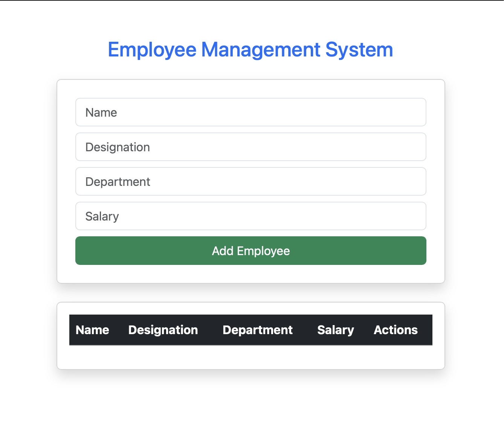
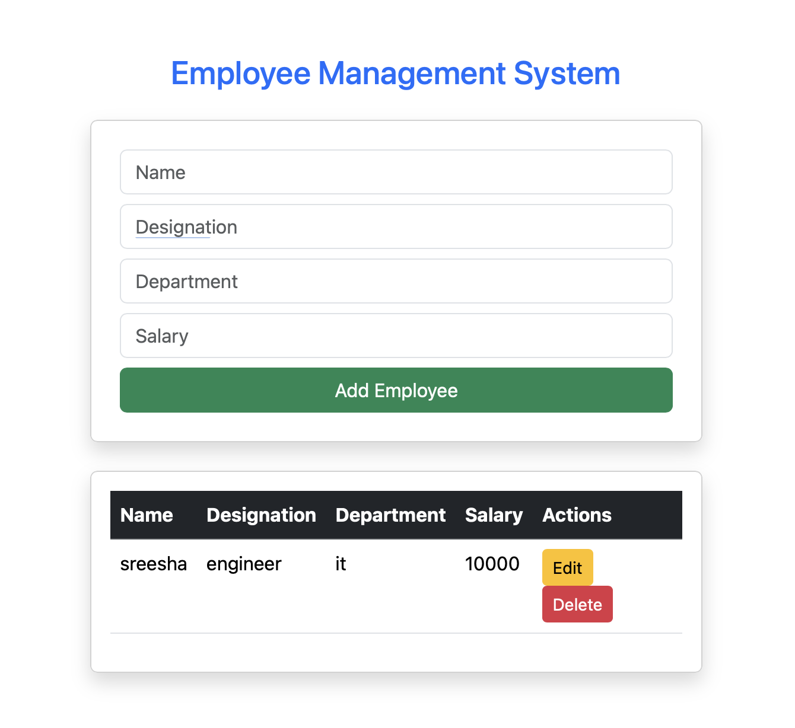
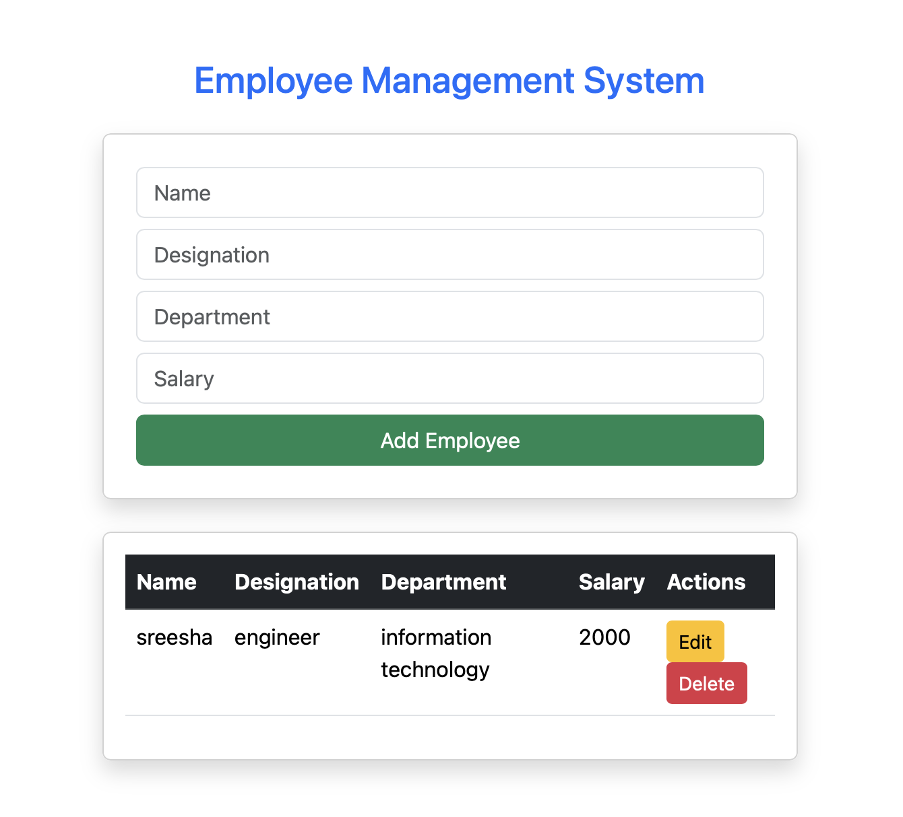
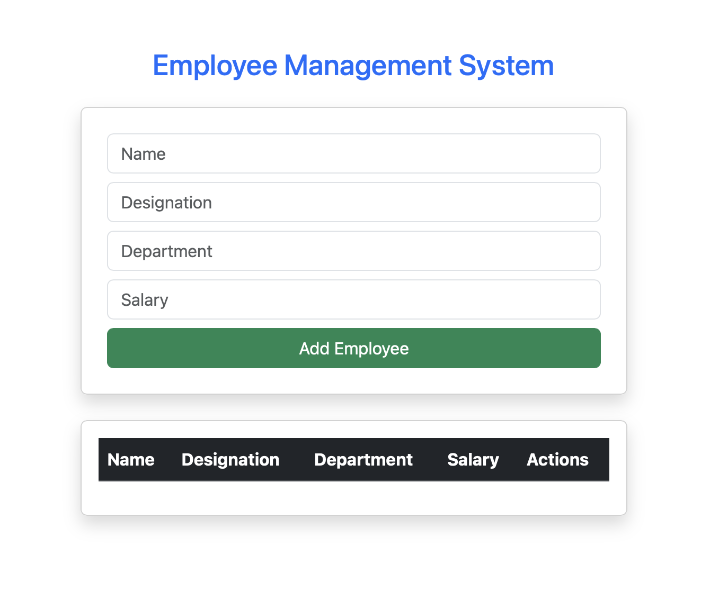

# Employee Management System

This project is built using Vue.js, Axios, and MockAPI.

## Features
- Add Employee
- View Employees
- Update Employee
- Delete Employee

## Technologies Used
- Vue.js
- Axios
- Bootstrap
- MockAPI

## Screenshots

### Home Page

### Add Employee

### Edit Employee

### Delete Employee

